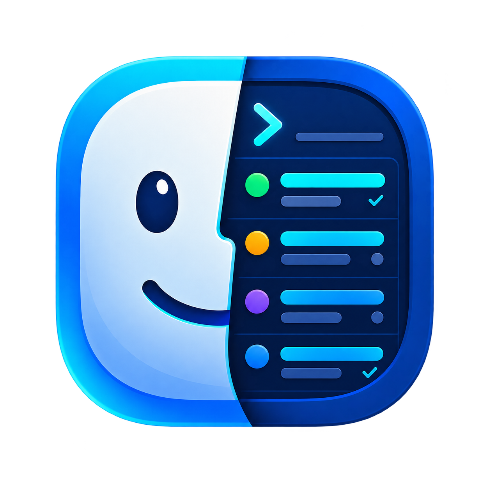

<div align="center">

  

  # Macventory

  **A clear, portable inventory of the software installed on your Mac.**

  [](#requirements)
  [](#requirements)
  [](.github/workflows/ci.yml)
[](LICENSE)

</div>

## Overview

Macventory is a command-line tool that creates an inventory of the software installed on your Mac.

It records macOS applications, Homebrew packages, global language packages, developer tools, Docker resources and executables, then generates a timestamped Markdown report on your Desktop to save and review.

> [!IMPORTANT]
> Macventory is an inventory tool, not a backup or migration utility. It does not preserve applications, personal data, application settings, credentials or licences.

## Features

- Generates one portable, timestamped Markdown report on your Desktop
- Detects installed macOS applications and their versions
- Records Homebrew formulae, casks, taps and services
- Produces an embedded Brewfile for use as a reinstall reference
- Detects global npm, pnpm, Yarn, pipx, uv, RubyGems and Cargo packages
- Records Docker images, containers and volume names
- Captures major developer-tool and SDK versions
- Detects Visual Studio Code and Cursor extensions when their CLIs are available
- Lists executables from common user-controlled binary directories
- Redacts hardware serial numbers, UUIDs and provisioning identifiers
- Continues safely when optional tools are unavailable

## Requirements

- macOS
- Go 1.23 or newer when building from source
- Optional collectors:
  - Homebrew
  - `mas`
  - Docker
  - Visual Studio Code CLI
  - Cursor CLI
  - Language-specific package managers

Macventory still produces a report when optional collectors are unavailable.

## Installation

### Build from source

```bash
git clone https://github.com/johncrawley/macventory.git
cd macventory/Codebase

go build -o macventory .